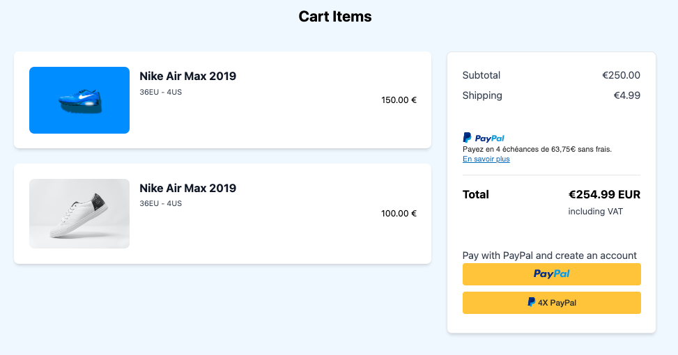
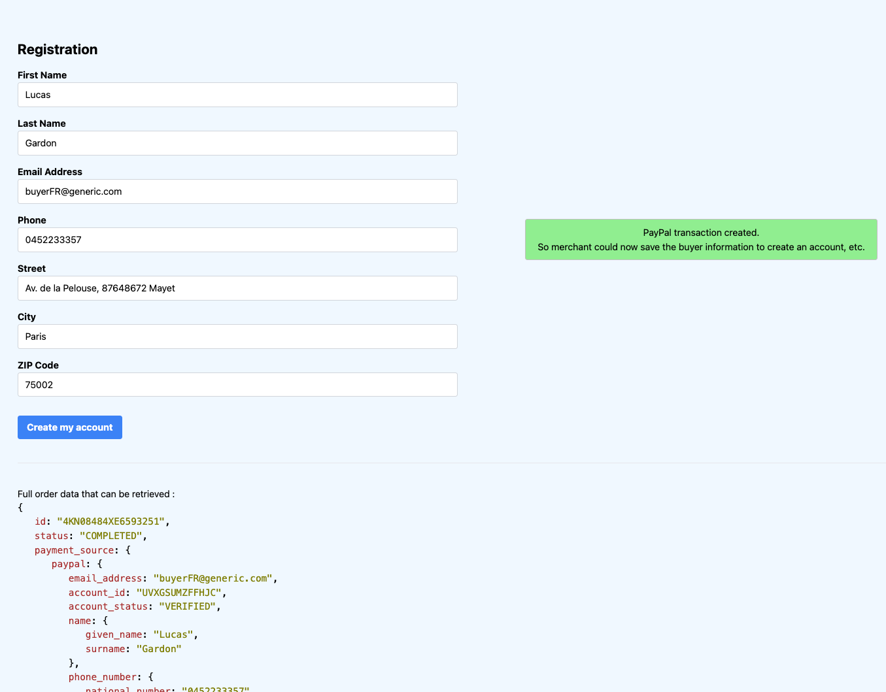

# PayPal NodeJS Integration

PayPal Tutorial: [https://developer.paypal.com/docs/checkout/standard/integrate/](https://developer.paypal.com/docs/checkout/standard/integrate/)

## Installation

1. Clone the repository: `git clone https://github.com/lugapi/PayPal_ECS`
2. Install dependencies: `npm install`

## Configuration

Duplicate `.env.exemple` to a `.env` file at the root of the project and add the necessary environment variables.

## How to Run

To start the project, run the following command:

```bash
npm install
npm start
```

## How to Use

Once the customer has completed the payment with PayPal, response is saved in cookie and customer is redirected on registration page with the registration form already (pre)filled.

## Screenshots

- Cart


<br />

- Registration
